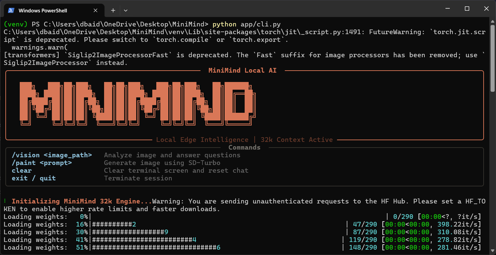
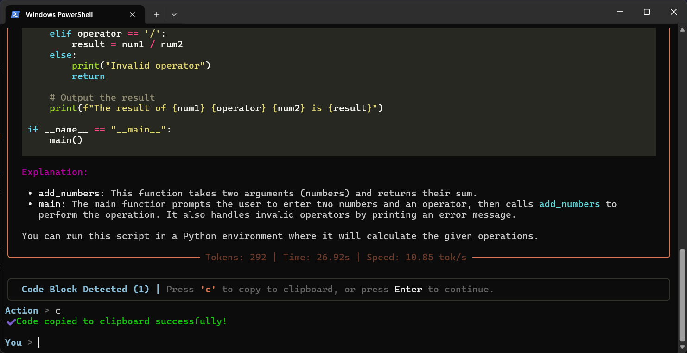
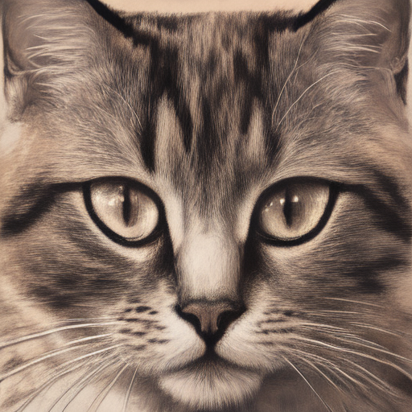
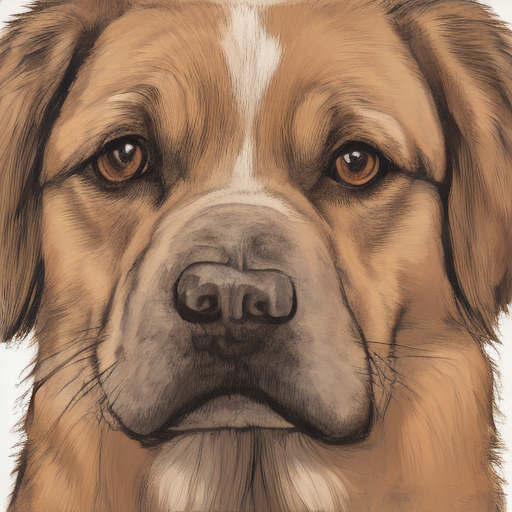

# MiniMind



MiniMind is a lightweight, fully private multimodal AI assistant. It runs entirely on your machine with no cloud dependencies. Built on Qwen2.5-0.5B with LoRA fine-tuning, it supports text chat, image generation (SD-Turbo), and image understanding (Moondream2).

## Features

- **100% Offline & Private** - All inference runs locally, no external API calls
- **Text Chat** - Interactive CLI with history retention and FastAPI backend with Swagger docs
- **Image Generation** - Text-to-image via Stable Diffusion Turbo (single-step, near-instant)
- **Vision** - Image analysis and visual QA via Moondream2 vision-language model
- **LoRA Fine-Tuning** - Efficient adapter training targeting q_proj, k_proj, v_proj, o_proj
- **Hardware Agnostic** - Runs on mid-range laptop CPUs (32-bit) or NVIDIA GPUs (FP16/CUDA)
- **Weight Fusion** - Merge LoRA adapters into base model for standalone deployment or GGUF export

## Technical Specifications

| Component | Model / Spec |
| --- | --- |
| Base Architecture | Qwen 2.5 (0.5B, Instruct variant) |
| Fine-Tuning | SFT with LoRA (r=8, alpha=16, dropout=0.05) |
| Max Sequence Length | 256-512 tokens |
| Text-to-Image | Stability AI SD-Turbo (1 inference step) |
| Vision Model | Moondream2 (revision 2024-08-26) |
| Inference Framework | PyTorch, Hugging Face transformers, peft |
| Recommended Hardware | 8 GB+ RAM (CPU) or 4 GB+ VRAM (GPU) |

## Installation

```bash
# Clone the repository
git clone https://github.com/dbaidya811/MiniMind.git
cd MiniMind

# Create virtual environment
python -m venv venv
source venv/bin/activate  # Linux/macOS
# .\venv\Scripts\Activate.ps1  # Windows

# Install dependencies
pip install -r requirements.txt
```

## Dataset Format

Training data uses ChatML format in `data/train.jsonl` and `data/val.jsonl`:

```json
{"messages": [{"role": "system", "content": "You are MiniMind, a helpful assistant."}, {"role": "user", "content": "Hi"}, {"role": "assistant", "content": "Hello! How can I help you?"}]}
```

## Training

### Local Training
```bash
python src/train.py
```

### Cloud GPU (Google Colab T4)
1. Set runtime to T4 GPU
2. Install: `!pip install -q torch transformers datasets peft trl accelerate`
3. Run the SFT training loop
4. Download and extract `final_adapter.zip` into `models/final_adapter/`

## Usage

### Interactive CLI

```bash
python app/cli.py
```

Commands:
- `/vision <image_path> [question]` - Analyze an image and answer a question
- `/paint <prompt>` - Generate a new image from text prompt
- Type `exit` to quit

### FastAPI Server

```bash
uvicorn app.api:app --reload --host 0.0.0.0 --port 8000
```

- API docs: http://127.0.0.1:8000/docs
- REST endpoint: `POST /chat`

Example request:
```json
{
  "messages": [{"role": "user", "content": "Hello!"}],
  "max_tokens": 100,
  "temperature": 0.7
}
```

### Programmatic

```python
# Text chat
from src.inference import MiniMindEngine
bot = MiniMindEngine()
reply, stats = bot.generate([{"role": "user", "content": "Hello!"}])

# Image generation
from src.image_gen import ImageGenerator
gen = ImageGenerator()
gen.generate("a cute cat", output_path="outputs/cat.png")

# Vision
from src.vision import VisionEngine
vision = VisionEngine()
answer = vision.describe_or_answer("photo.jpg", "What is in this image?")
```

## Image Generation

MiniMind includes a local text-to-image engine powered by **Stable Diffusion Turbo**, optimized for near-instant generation with a single inference step.



Use the `/paint` command in the CLI or the `ImageGenerator` class programmatically. Generated images are saved to `outputs/` by default.

## Vision / Image Understanding

MiniMind can analyze images and answer questions about them using **Moondream2**, a lightweight vision-language model.


Use the `/vision` command in the CLI or the `VisionEngine` class programmatically.

## Gallery

|  |  |
| --- | --- |
| **CAT** | **DOG** |

## Merge Adapters (Optional)

```bash
python src/merge.py
```

Fuses LoRA weights into the base model, exporting to `models/merged_minimind/`.

## Project Structure

```
MiniMind/
├── app/           # CLI (cli.py) and FastAPI (api.py)
├── data/          # train.jsonl and val.jsonl datasets
├── models/        # checkpoints, final_adapter, merged_minimind
├── outputs/       # Generated images (created automatically)
├── src/           # Core modules (inference, vision, image_gen, train, merge, dataset)
└── requirements.txt
```

## Roadmap

- [ ] GGUF quantization support (Q4_K_M / Q8_0) for llama.cpp
- [ ] Token-by-token streaming via Server-Sent Events (SSE)
- [ ] Lightweight web UI with React and Tailwind CSS

## License


This project is licensed under the **MIT License**.